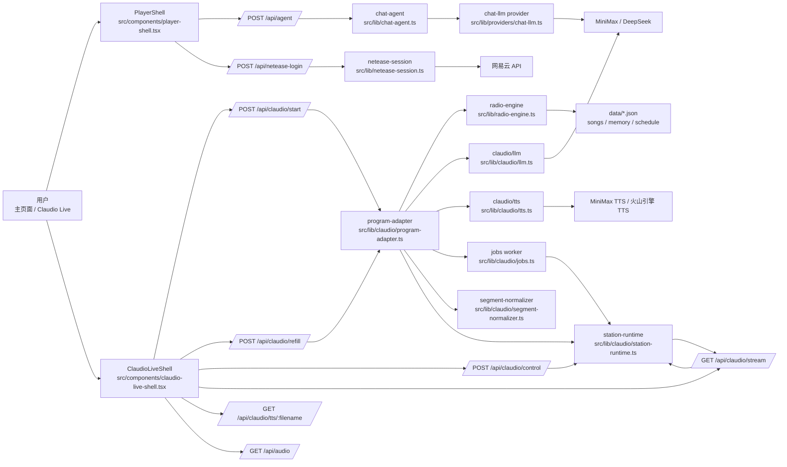
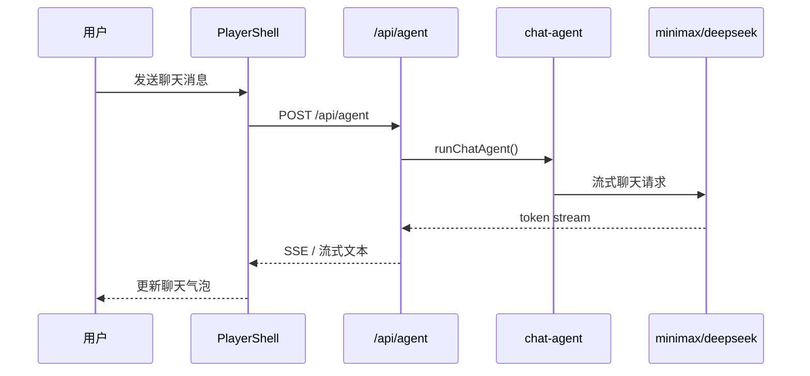
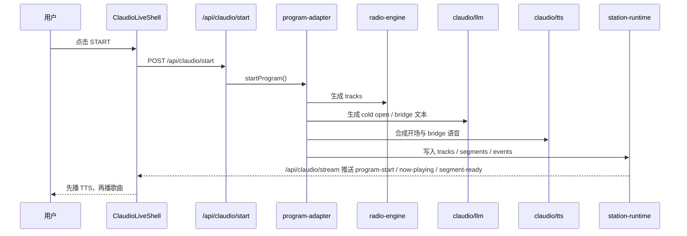
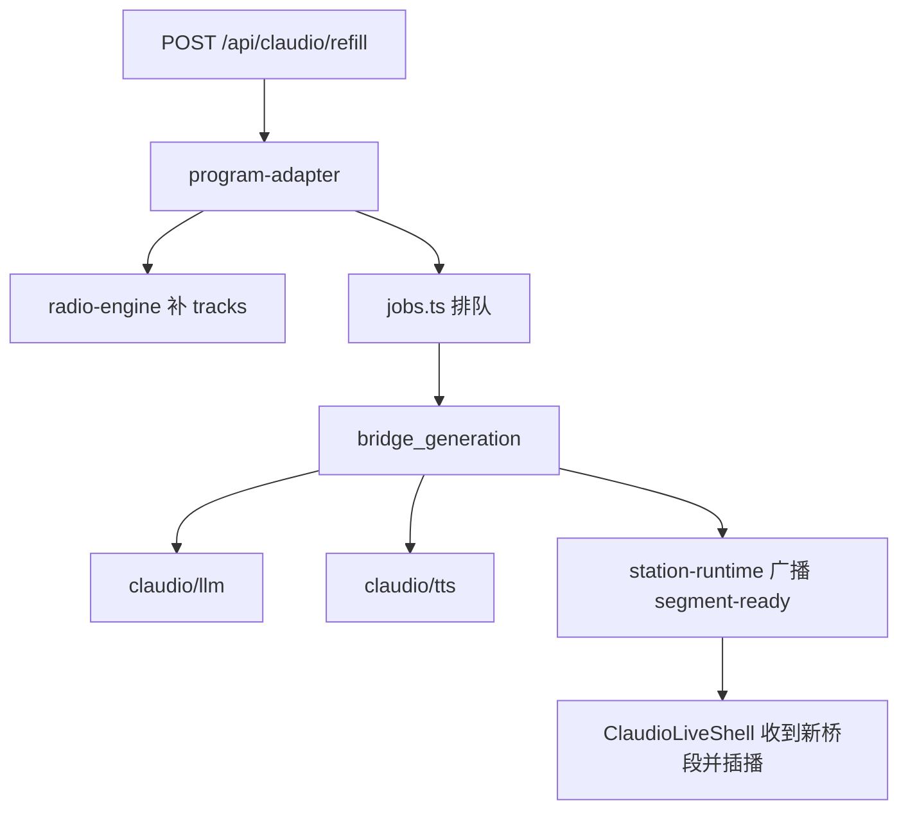
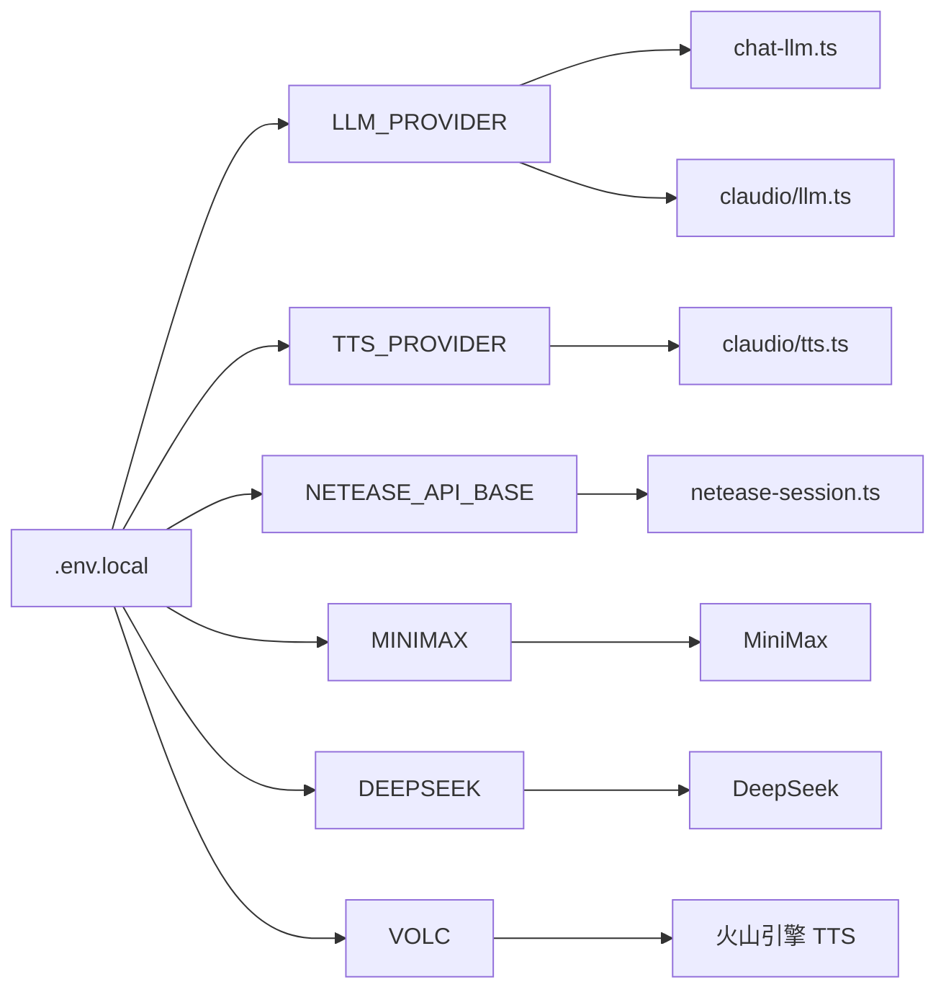
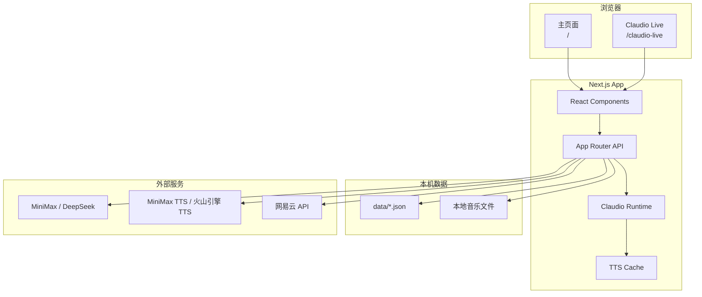
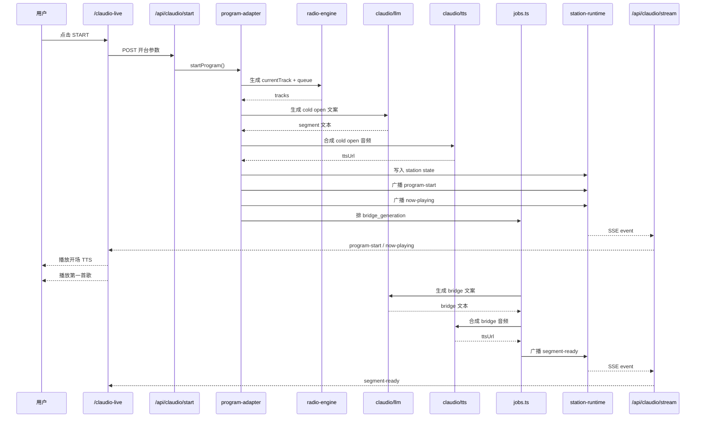

# Claudio 架构图

这份文档只描述当前 `radio-app` 里已经接进去的 Claudio 主流程，不覆盖旧版 `docs/architecture-map.md` 的全量模块速查。

## 总览



## 框架图

```mermaid
flowchart TB
    subgraph L1["页面层"]
        MAINUI[主页面<br/>PlayerShell]
        LIVEUI[直播页<br/>ClaudioLiveShell]
    end

    subgraph L2["接口层"]
        AGENTAPI[/api/agent]
        LOGINAPI[/api/netease-login]
        STARTAPI[/api/claudio/start]
        REFILLAPI[/api/claudio/refill]
        CONTROLAPI[/api/claudio/control]
        STREAMAPI[/api/claudio/stream]
        TTSAPI[/api/claudio/tts/:filename]
        AUDIOAPI[/api/audio]
    end

    subgraph L3["运行时层"]
        CHATAGENT[chat-agent]
        PROGRAMADAPTER[program-adapter]
        RUNTIMECORE[station-runtime]
        JOBWORKER[jobs worker]
        NORMALIZER[segment-normalizer]
    end

    subgraph L4["能力层"]
        RADIOENGINE[radio-engine]
        CHATLLM[chat-llm]
        CLLM[claudio/llm]
        CTTS[claudio/tts]
        NETEASESESSION[netease-session]
    end

    subgraph L5["数据与外部依赖"]
        LOCALDATA[data/*.json]
        AUDIOFILES[本地音乐文件]
        MINIMAX[MiniMax]
        DEEPSEEK[DeepSeek]
        VOLC[火山引擎 TTS]
        NETEASEAPI[网易云 API]
    end

    MAINUI --> AGENTAPI
    MAINUI --> LOGINAPI

    LIVEUI --> STARTAPI
    LIVEUI --> REFILLAPI
    LIVEUI --> CONTROLAPI
    LIVEUI --> STREAMAPI
    LIVEUI --> TTSAPI
    LIVEUI --> AUDIOAPI

    AGENTAPI --> CHATAGENT
    LOGINAPI --> NETEASESESSION
    STARTAPI --> PROGRAMADAPTER
    REFILLAPI --> PROGRAMADAPTER
    CONTROLAPI --> RUNTIMECORE
    STREAMAPI --> RUNTIMECORE

    CHATAGENT --> CHATLLM
    PROGRAMADAPTER --> RADIOENGINE
    PROGRAMADAPTER --> CLLM
    PROGRAMADAPTER --> CTTS
    PROGRAMADAPTER --> NORMALIZER
    PROGRAMADAPTER --> JOBWORKER
    PROGRAMADAPTER --> RUNTIMECORE
    JOBWORKER --> CLLM
    JOBWORKER --> CTTS
    JOBWORKER --> RUNTIMECORE

    RADIOENGINE --> LOCALDATA
    AUDIOAPI --> AUDIOFILES
    CHATLLM --> MINIMAX
    CHATLLM --> DEEPSEEK
    CLLM --> MINIMAX
    CLLM --> DEEPSEEK
    CTTS --> MINIMAX
    CTTS --> VOLC
    NETEASESESSION --> NETEASEAPI
```

这张图看的是“框架分层”，不是某一次请求的时序：

- 页面层只负责交互和播放，不直接碰模型和数据。
- 接口层统一承接页面请求，是前端和后端能力的边界。
- 运行时层负责 Claudio 节目状态、事件广播、异步 bridge job。
- 能力层是可复用的业务能力，包括选歌、LLM、TTS、网易云登录。
- 最底层才是本地数据和外部服务。

## 主链路

### 1. 主页面聊天



说明：

- 主聊天页面继续复用 `PlayerShell`，没有另做第二套 UI。
- 模型出口已经不再走本地 Hermes，统一走 `LLM_PROVIDER=minimax|deepseek`。
- 推荐语重写也已经走同一个 provider 层。

### 2. Claudio 开台与播放



说明：

- 选歌目前仍谨慎复用 `radio-engine`，没有直接改成“LLM 产 play[]”。
- Claudio 的开场语、bridge 已经走独立的 `claudio/llm.ts` 和 `claudio/tts.ts`。
- 事件通道目前是 SSE，不是 WebSocket。

### 3. Claudio 补歌与 bridge



说明：

- `refill` 不只是补歌，还会继续安排 `bridge_generation`。
- `segment-ready` 到达前，队列也可以先继续走；到达后再在合适的位置播报。

## 模块分层

### 前端层

- `src/components/player-shell.tsx`
  主页面 UI、聊天 UI、顶部字体和登录按钮都在这里。
- `src/components/claudio-live-shell.tsx`
  Claudio live 页，消费 `/api/claudio/stream`，负责 TTS/音频播放推进。
- `src/app/claudio-live/page.tsx`
  Claudio live 页面入口。

### API 层

- `src/app/api/agent/route.ts`
  主聊天流式接口。
- `src/app/api/netease-login/route.ts`
  网易云二维码登录接口。
- `src/app/api/claudio/start/route.ts`
  启动 Claudio 节目。
- `src/app/api/claudio/refill/route.ts`
  Claudio 补歌。
- `src/app/api/claudio/control/route.ts`
  `next / pause / resume / volume` 控制。
- `src/app/api/claudio/stream/route.ts`
  Claudio SSE 事件流。
- `src/app/api/claudio/tts/[filename]/route.ts`
  Claudio TTS 文件播放出口。
- `src/app/api/audio/route.ts`
  本地音乐文件代理与 Range 支持。

### Claudio runtime 层

- `src/lib/claudio/types.ts`
  `track / segment / event / station state / job` 协议定义。
- `src/lib/claudio/station-runtime.ts`
  单例状态容器、订阅广播、当前节目状态。
- `src/lib/claudio/jobs.ts`
  串行 job worker，负责 bridge 等异步任务。
- `src/lib/claudio/program-adapter.ts`
  把现有 `radio-engine` 产物转换为 Claudio 所需的 `tracks + segments + events`。
- `src/lib/claudio/segment-normalizer.ts`
  统一 bridge/cold open/intro segment 的结构。

### 模型与 TTS 层

- `src/lib/providers/chat-llm.ts`
  主聊天与推荐语重写共用的 provider 封装。
- `src/lib/claudio/llm.ts`
  Claudio 专用节目文案生成。
- `src/lib/claudio/tts.ts`
  Claudio 专用 TTS 合成与缓存。

支持配置：

- `LLM_PROVIDER=minimax|deepseek`
- `TTS_PROVIDER=minimax|volcengine`

### 数据层

- `src/lib/radio-engine.ts`
  当前主选歌逻辑入口。
- `data/`
  本地持久化数据，如 `songs / memory / schedule`。
- `src/lib/netease-session.ts`
  网易云登录 cookie 生命周期管理。

## 当前边界

已经完成：

- 主聊天 UI 与 Claudio live UI 并存。
- 主聊天出口已迁到 `minimax/deepseek`。
- Claudio `start -> 开场 TTS -> 首歌 -> refill -> bridge -> 下一首` 主流程已跑通。
- 网易云二维码登录已接回项目。

还未完成：

- `Claudio live` 的 caller/chat on-air 流程还没接。
- 选歌仍主要复用当前 `radio-engine`，还不是原 Claudio 那种完整节目编排后端。
- 外部对照页 `src/app/claudio-live/external/route.ts` 仍保留，仅用于对照。

## 配置关系



## 部署视角



这张图看的是“程序部署在哪、依赖谁”：

- 浏览器里只有两个主要入口：主页面和 `Claudio Live`。
- 核心逻辑都在同一个 `Next.js App` 里，没有额外常驻独立 Claudio 服务。
- 本地数据仍分成两类：`data/*.json` 状态数据，和本地音乐文件。
- 模型、TTS、网易云都还是外部依赖。

## 开台详细时序



这张图看的是“点下 START 后，主流程怎么一步步跑完”：

- `radio-engine` 仍负责拿可播歌曲。
- `claudio/llm.ts` 负责把节目口播内容生成出来。
- `claudio/tts.ts` 把口播变成实际可播音频。
- `station-runtime` 统一对外广播状态。
- `jobs.ts` 把 bridge 这种异步后续任务串起来，不阻塞首歌启动。

建议配合阅读：

- [src/components/player-shell.tsx](/Users/lipan/Desktop/radio-app/src/components/player-shell.tsx)
- [src/components/claudio-live-shell.tsx](/Users/lipan/Desktop/radio-app/src/components/claudio-live-shell.tsx)
- [src/lib/claudio/program-adapter.ts](/Users/lipan/Desktop/radio-app/src/lib/claudio/program-adapter.ts)
- [src/lib/claudio/station-runtime.ts](/Users/lipan/Desktop/radio-app/src/lib/claudio/station-runtime.ts)
