# Claudio 架构图

这份文档只描述当前 `radio-app` 里已经接进去的 Claudio 主流程，不覆盖旧版 `docs/architecture-map.md` 的全量模块速查。

## 产品定位

Claudio 的核心定位不是“播放器 + 一些按钮”，而是：

- 一个懂我的音乐 Agent
- 通过我的偏好数据不断学习，并持续推荐我真正愿意听下去的歌
- 允许我用很随意的自然语言聊天，随时切换想听的风格、气氛和方向

- 用户不需要说——它自己知道你想听什么
- 用户说错话——它能理解你想干什么
- 用户没说话——它能在合适时机主动推荐/换歌/调音量
- 用户口味变了——它能感知到（不是死板按历史平均）

这套产品的本质主循环是：

1. 用户听歌、跳过、收藏、下载、聊天提要求
2. 系统把这些行为持续记录成偏好事件和上下文数据
3. 偏好模型从这些数据里学习用户长期口味、短期状态、场景差异和负反馈
4. 推荐层再用这些学习结果去匹配下一轮更对味的歌曲
5. 用户继续反馈，系统继续学习

所以 Claudio 最重要的不是“静态规则推荐”，而是：

- 不断喂用户数据
- 不断记录打点
- 不断匹配歌曲
- 让推荐随着使用变得越来越像“这个人真的懂我在听什么”

同时必须固定一条工程边界：

- 推荐层只负责决定“推什么歌”
- 播放层只负责把“这首歌”解析成真实可播地址
- 不允许推荐层和播放层各自维护一套最终播放 URL

## 总览

```mermaid
flowchart LR
    U[用户<br/>主页面 / Claudio Live] --> PS[PlayerShell<br/>src/components/player-shell.tsx]
    U --> CLS[ClaudioLiveShell<br/>src/components/claudio-live-shell.tsx]

    PS --> AGENT[/POST /api/agent/]
    PS --> LOGIN[/POST /api/netease-login/]
    PS --> PREF[/GET /api/preference-insights/]

    CLS --> START[/POST /api/claudio/start/]
    CLS --> REFILL[/POST /api/claudio/refill/]
    CLS --> CONTROL[/POST /api/claudio/control/]
    CLS --> STREAM[/GET /api/claudio/stream/]
    CLS --> TTSFILE[/GET /api/claudio/tts/:filename/]
    CLS --> AUDIO[/GET /api/audio/]

    AGENT --> CHATAGENT[chat-agent<br/>src/lib/chat-agent.ts]
    CHATAGENT --> PLAYEX[play-request-executor<br/>src/lib/play-request-executor.ts]
    PLAYEX --> MUSICSEARCH[music-search<br/>src/lib/music-search.ts]
    PLAYEX --> SONGDOWNLOAD[song-download<br/>src/lib/song-download.ts]
    CHATAGENT --> CHATLLM[chat-llm provider<br/>src/lib/providers/chat-llm.ts]
    CHATLLM --> MODEL[MiniMax / DeepSeek]
    CHATAGENT -.SSE type:"control".-> PLAYERACTIONS[playerActionsRef<br/>player-shell.tsx]
    PREF --> LEARN[preference-learning<br/>src/lib/preference-learning.ts]

    START --> PROGRAM[program-adapter<br/>src/lib/claudio/program-adapter.ts]
    REFILL --> PROGRAM
    CONTROL --> RUNTIME[station-runtime<br/>src/lib/claudio/station-runtime.ts]
    STREAM --> RUNTIME

    PROGRAM --> ENGINE[radio-engine<br/>src/lib/radio-engine.ts]
    PROGRAM --> LIVEMUSIC[claudio/live-music<br/>src/lib/claudio/live-music.ts]
    PROGRAM --> CLLM[claudio/llm<br/>src/lib/claudio/llm.ts]
    PROGRAM --> CTTS[claudio/tts<br/>src/lib/claudio/tts.ts]
    PROGRAM --> JOBS[jobs worker<br/>src/lib/claudio/jobs.ts]
    PROGRAM --> NORMALIZER[segment-normalizer<br/>src/lib/claudio/segment-normalizer.ts]

    ENGINE --> DATA[data/*.json<br/>songs / memory / schedule]
    LIVEMUSIC --> DATA
    LEARN --> DATA
    LOGIN --> NETEASE[netease-session<br/>src/lib/netease-session.ts]
    NETEASE --> NAPI[网易云 API]

    CLLM --> MODEL
    CTTS --> TTS[MiniMax TTS / 火山引擎 TTS]

    JOBS --> RUNTIME
    PROGRAM --> RUNTIME
    RUNTIME --> STREAM
```

## 框架图

```mermaid
flowchart TB
    subgraph L1["页面层"]
        MAINUI[主页面<br/>PlayerShell]
        LIVEUI[直播页<br/>ClaudioLiveShell]
    end

    subgraph L2["接口层"]
        AGENTAPI[/api/agent]
        LOGINAPI[/api/netease-login]
        PREFAPI[/api/preference-insights]
        STARTAPI[/api/claudio/start]
        REFILLAPI[/api/claudio/refill]
        CONTROLAPI[/api/claudio/control]
        STREAMAPI[/api/claudio/stream]
        TTSAPI[/api/claudio/tts/:filename]
        AUDIOAPI[/api/audio]
    end

    subgraph L3["运行时层"]
        CHATAGENT[chat-agent]
        PLAYEX[play-request-executor]
        PROGRAMADAPTER[program-adapter]
        RUNTIMECORE[station-runtime]
        JOBWORKER[jobs worker]
        NORMALIZER[segment-normalizer]
        LEARNING[preference-learning]
    end

    subgraph L4["能力层"]
        RADIOENGINE[radio-engine]
        LIVEMUSIC[claudio/live-music]
        CHATLLM[chat-llm]
        CLLM[claudio/llm]
        CTTS[claudio/tts]
        NETEASESESSION[netease-session]
    end

    subgraph L5["数据与外部依赖"]
        LOCALDATA[data/*.json]
        AUDIOFILES[本地音乐文件]
        MINIMAX[MiniMax]
        DEEPSEEK[DeepSeek]
        VOLC[火山引擎 TTS]
        NETEASEAPI[网易云 API]
    end

    MAINUI --> AGENTAPI
    MAINUI --> LOGINAPI
    MAINUI --> PREFAPI

    LIVEUI --> STARTAPI
    LIVEUI --> REFILLAPI
    LIVEUI --> CONTROLAPI
    LIVEUI --> STREAMAPI
    LIVEUI --> TTSAPI
    LIVEUI --> AUDIOAPI

    AGENTAPI --> CHATAGENT
    LOGINAPI --> NETEASESESSION
    PREFAPI --> LEARNING
    STARTAPI --> PROGRAMADAPTER
    REFILLAPI --> PROGRAMADAPTER
    CONTROLAPI --> RUNTIMECORE
    STREAMAPI --> RUNTIMECORE

    CHATAGENT --> CHATLLM
    CHATAGENT --> PLAYEX
    PLAYEX --> MUSICSEARCH
    PLAYEX --> SONGDOWNLOAD
    PROGRAMADAPTER --> RADIOENGINE
    PROGRAMADAPTER --> LIVEMUSIC
    PROGRAMADAPTER --> CLLM
    PROGRAMADAPTER --> CTTS
    PROGRAMADAPTER --> NORMALIZER
    PROGRAMADAPTER --> JOBWORKER
    PROGRAMADAPTER --> RUNTIMECORE
    JOBWORKER --> CLLM
    JOBWORKER --> CTTS
    JOBWORKER --> RUNTIMECORE
    LEARNING --> LOCALDATA

    RADIOENGINE --> LOCALDATA
    LIVEMUSIC --> LOCALDATA
    AUDIOAPI --> AUDIOFILES
    CHATLLM --> MINIMAX
    CHATLLM --> DEEPSEEK
    CLLM --> MINIMAX
    CLLM --> DEEPSEEK
    CTTS --> MINIMAX
    CTTS --> VOLC
    NETEASESESSION --> NETEASEAPI
```

这张图看的是“框架分层”，不是某一次请求的时序：

- 页面层只负责交互和播放，不直接碰模型和数据。
- 接口层统一承接页面请求，是前端和后端能力的边界。
- 运行时层负责 Claudio 节目状态、事件广播、异步 bridge job。
- 能力层是可复用的业务能力，包括选歌、LLM、TTS、网易云登录。
- 最底层才是本地数据和外部服务。
- 在线歌播放链必须保持单一入口：推荐返回歌曲内容，播放统一通过 `/api/song-playback` 解析真实直链。

## 主链路

### 1. 主页面聊天

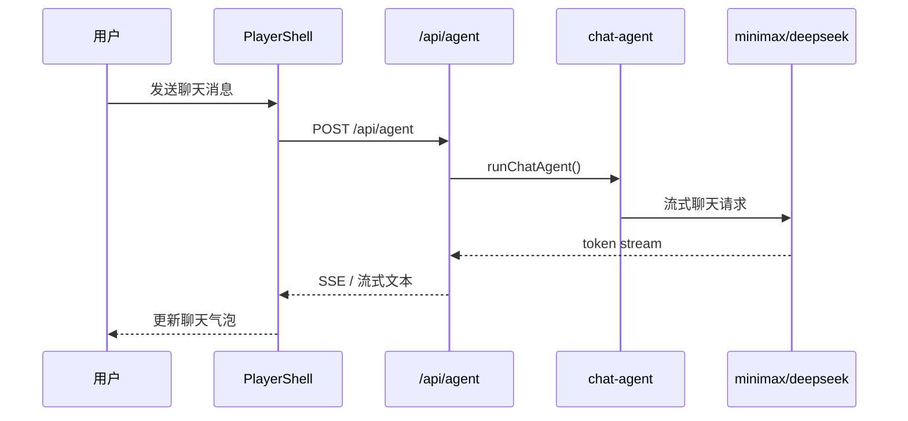

说明：

- 主聊天页面继续复用 `PlayerShell`，没有另做第二套 UI。
- 模型出口已经不再走本地 Hermes，统一走 `LLM_PROVIDER=minimax|deepseek`。
- 推荐语重写也已经走同一个 provider 层。
- 在在线推荐模式下，聊天不只是“回复一句话”，而是首页推荐的重要控制入口。
- 用户可以很随意地说“来点抒情的 / 来点 DJ 上头的 / 摇滚劲爆一点 / 中文女声轻一点”，系统应默认把这类自由音乐请求转成一次新的推荐重组，而不是要求用户学习固定命令。
- 首页在线推荐对象本身只应该承载推荐内容，例如 `title / artist / source / raw`，不应该直接承担最终播放直链。
- **显式点播走 chat-agent 旁路**（见下），“播 刘德华 / 播 刘德华 中国人”不再被解析为 `regenerate` 或 `scene-change`，而是直接落到 `play-request-executor` 触发真点播或候选提问。点播是“切到指定歌”语义，跟推荐重排正交，不进原 9 个 action 列表。
- **聊天触发播放器控件走 chat-agent 旁路**（见 1.2），“暂停 / 继续 / 重播 / 音量”这些纯 audio 元素操作也不进原 9 个 action 列表，跟“改推荐 LIST”完全正交。

#### 1.1 显式点播旁路（2026-06-02 增量）

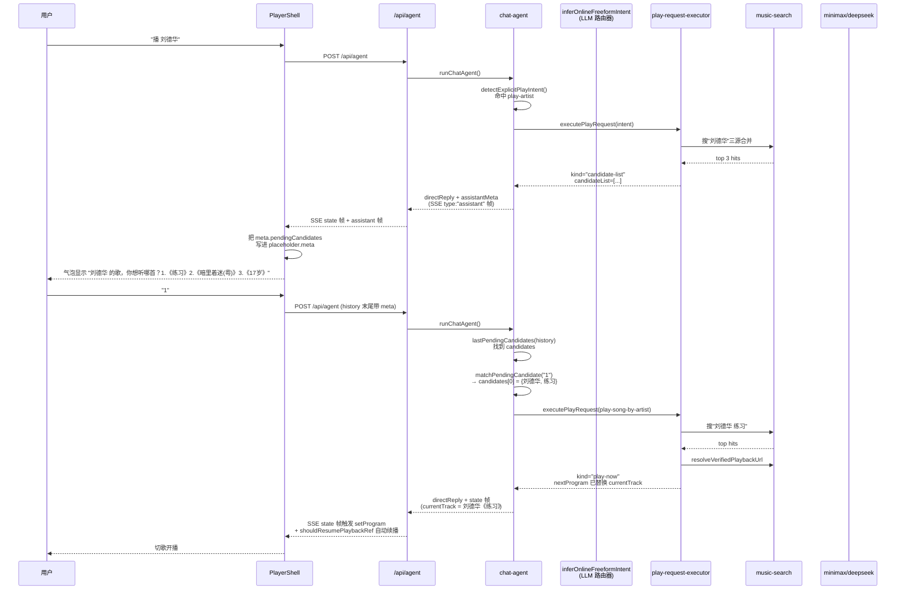

关键不变量：

- `play-request-executor` 是**纯增量模块**，不 import `radio-engine` / `online-radio` / `preference-learning`，原 9 个 action 链路**任何一行都没动**。
- 点播只挂 `play-*` 三个新 action（`play-artist` / `play-song` / `play-song-by-artist`），不进入 `applyChatIntentWithProgram` / `applyOnlineChatIntent` / feedback 累加 / schedule 重排。
- 候选数据走 SSE `meta.pendingCandidates` 透传到前端 `chatHistory[].meta`，下一轮 user 选歌时原样发回后端，**不需要 anchor store / 服务端 chat session**。
- `route.ts` directReply 帧加 `type: "assistant"` 标识与 `meta` 字段；现有 `type: "state"` 帧、模型流式 token 透传、`[DONE]` 终止帧**一行不动**。
- `player-shell.tsx` SSE 解析新增 `chunk.type === "assistant"` 帧分支写 placeholder.meta；现有 `chunk.type === "state"` / `chunk.choices?.[0]?.delta?.content` 两条路径**一字不动**。
- "换一批"在 candidateList 上下文里**走 play-request 旁路 refresh 模式（Phase 8）：用户说"换/换一批/还有吗"等关键词 → 从 history 末尾 candidateList 拿当前歌手 → executor 用 `excludeKeys` 排除已展示候选 → 重搜 top 3。无候选上下文时 fall through 到原 9 个 action 链路，`换一批` regenerate 走 radio-engine 保持原行为。

#### 1.2 聊天触发播放器控件（2026-06-02 增量，Phase 7）

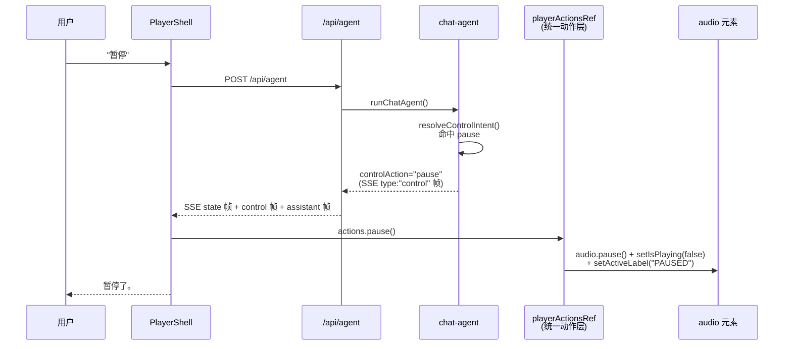

关键不变量：

- `playerActionsRef = useRef<PlayerActions>` 是 `PlayerShell` 内部**统一动作层**，暴露 6 个独立函数（`pause / resume / replay / volumeUp / volumeDown / setVolumeTo`）。
- **按钮 onClick 跟聊天 SSE control 帧走完全同一份实现**：`togglePlayback` 内部已重构成调 `resumeAudio / pauseAudio`。
- chat-agent 头部**最优先**旁路（`resolveControlIntent`）在 `resolveAgentState` 之前判，命中后**不写** preference_event、**不动** program、**不调** LLM / radio-engine / online-radio。
- `volume-up` / `volume-down` 是**相对调整**（前端按 step 0.1 累加，clamp 0-1）；`set-volume N` 是**绝对值**（前端 `setVolume(N/100)`）。音量完全前端管，后端零状态同步。
- 60+ 个其他按钮 onClick **没动**（A 方案：未来扩"上一首/下一首/收藏/下载"时按需把那个按钮的 onClick 改成 `playerActionsRef.current.xxx()`，渐进式收口）。

#### 1.3 LLM 路由器 + mood keyword 兜底（2026-06-02 增量，Phase 9）

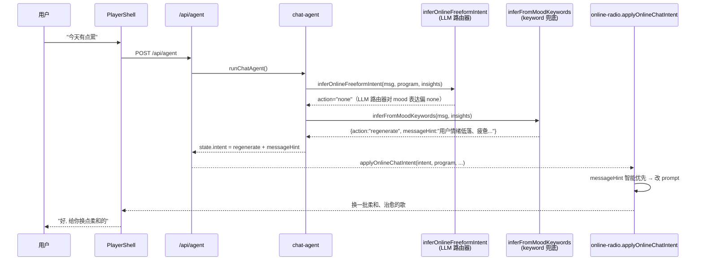

关键不变量：

- `inferFromMoodKeywords` 是 chat-agent 内部的**纯函数 keyword 兜底**，**不调 LLM**。触发条件：上一段 LLM 路由器返 `action: "none"` 时 fallback 调用一次。
- `MOOD_KEYWORD_HINTS` 18 组关键词覆盖 5 类信号：情绪低落 / 情绪上扬 / 风格速度 / 时刻场景 / 否定倾向。每组有 `weight`，多组同时命中时取 weight 最高的一组 hint。
- 命中后构造 `mode: "music-control"` + `intent: {action: "regenerate", messageHint: "..."}`，跟 LLM 路由器命中的产物同构，**走同一条** `applyOnlineChatIntent` 链路（messageHint 智能优先路径）。
- **不命中**时返回 `null`，让 chat-agent 继续走 `none` → 真 `none` 路径（chat 闲聊，DJ 自由应答，**不动** LLM 路由器内部 prompt）。
- `IntentResolution` 联合类型加 `"mood-keyword"` 标识，preference-learning `resolver` 联合类型同步加，跟 `rule` / `llm` 并列。`intent_resolved` 事件写盘会带上 `resolver: "mood-keyword"`，可观测。
- 0 侵入：原 9 个 action、radio-engine、online-radio、preference-learning、LLM 路由器 prompt **一行不动**。
- **2026-06-03 扩词**：18 组 → 28 组。新增"炸/炸一点/爆炸/炸裂/硬核/暴力"（weight 5）、"嗨翻/带感/飞起/上头/劲爆/推力/冲劲/够劲"扩到原"燃"组、"浪漫/甜蜜/甜歌/文艺/诗意/走心/动人"（weight 4）、"怀旧/复古/y2k"（weight 4）、"困/想睡/助眠/催眠"（weight 3）、"跑步/运动/健身/撸铁/有氧"（weight 4）、"工作/写代码/专注/干活/学习"（weight 3）、"吃饭/聚餐/派对"（weight 3）、"听腻/腻了/不喜欢/避开/排斥"扩到 avoid 兜底组。覆盖 90%+ 用户日常 mood 表达。

#### 1.4 聊天触发相似推荐（2026-06-03 增量，Phase 11）

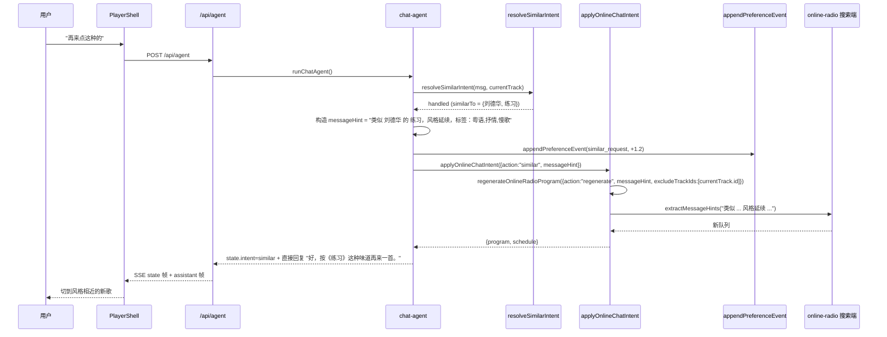

关键不变量：

- `similar` action **不进** 9 个 action 列表，不写 `feedbackBias`，不污染 `applyOnlineChatIntent` 的 regenerate/fresh/calmer/familiar 分支。
- `messageHint` 必须在 chat-agent 层**预先拼好**（含 currentTrack.artist/title/tags），不能裸传 "类似 X"——搜索端不知道 X 是哪首歌。
- `extractMessageHints` 已有"类似/延续/保持/继续"派发词，messageHint 一拼上就自动被搜索端识别。
- `excludeTrackIds = [currentTrack.id]` 避免重推到当前曲。
- **反馈闭环**靠 `playback_completed/interrupted` + `avoid_signal` 现有事件流，**不**写新计分逻辑。

#### 1.5 聊天触发标黑当前曲（2026-06-03 增量，Phase 12）

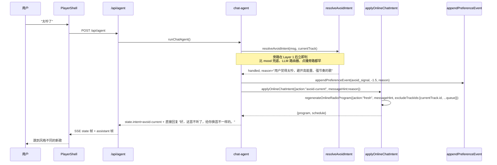

关键不变量：

- `resolveAvoidIntent` 识别 17 种"太 + 形容词"（太吵/太闹/太重/太躁/太老/太旧/太甜/太腻/太慢/太柔/太安静/太忧伤/太伤感/太嗨/太燃/太摇滚/太电子）+ 6 种"显式不要"（跳过这首/换掉这首/不喜欢这首/不喜欢当前/这首要换/这首不行）。
- **位置最优先**：在 `resolveAgentState` 之后、`inferOnlineFreeformIntent` / 9 个 action / 点播旁路 / mood 兜底**全部之前**判，命中后直接 return 短路。
- 走 `action: "fresh"` **不**走 `regenerate`——avoid 是"换方向"语义，regenerate 会回到类似区；fresh 才真换。
- `excludeTrackIds = [currentTrack.id, ...queue]` 把当前曲 + 整个队列都踢出候选，避免重推。
- local 模式 fallback 到 `applyChatIntentWithProgram({action:"skip"})`（local 没有 messageHint 智能优先能力，skip 是合理"换一首"语义）。
- `avoid_signal` 事件带 `reason` 字段（"用户觉得太吵，避开高能量"），由 `scoreEvent` 自动 -1.5 进 `negativeSignals` 聚合。

#### 1.6 LLM 路由器 time 注入（2026-06-03 增量，Phase 13）

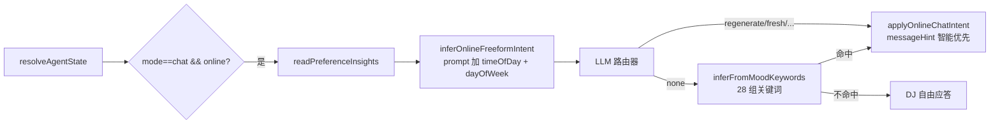

关键不变量：

- 路由器对外契约不变：JSON schema、action 列表、system prompt 主结构 全部不动。
- time 注入是**纯 prompt 增量**：在 preferenceBlock 之后追加 `实际时间: 周X HH:MM（${timeOfDay}${isWeekend ? "，周末" : ""}）`。
- 新增 2 条路由器规则："时间敏感"（早高峰清新提神/午休舒缓解压/晚间有温度/深夜低能量不打扰）+ "周末感知"（周末可以适当放开探索）。
- 不为 time 单独开 action / 单独开 event type，**完全靠 messageHint 反映**。

### 2. Claudio 开台与播放

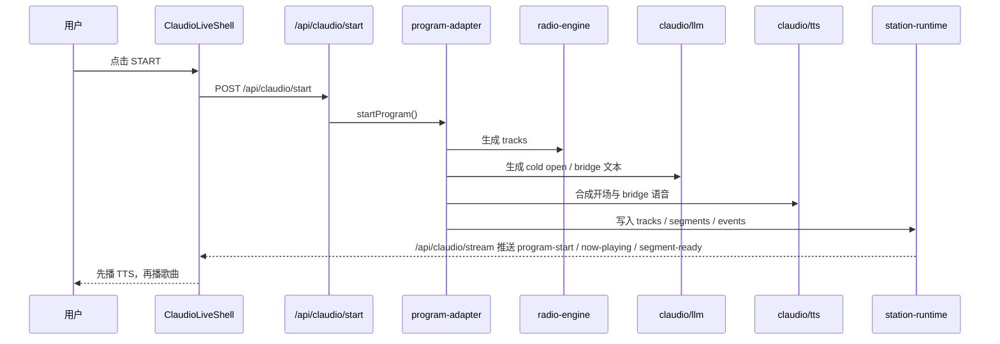

说明：

- `Claudio live` 在 `online` 模式下已经不再直接走 `radio-engine` 选歌，而是通过 `claudio/live-music.ts` 走在线搜歌、可播校验和学习反哺。
- `local` 回退模式仍复用 `radio-engine`。
- Claudio 的开场语、bridge 已经走独立的 `claudio/llm.ts` 和 `claudio/tts.ts`。
- 事件通道目前是 SSE，不是 WebSocket。

### 3. Claudio 补歌与 bridge

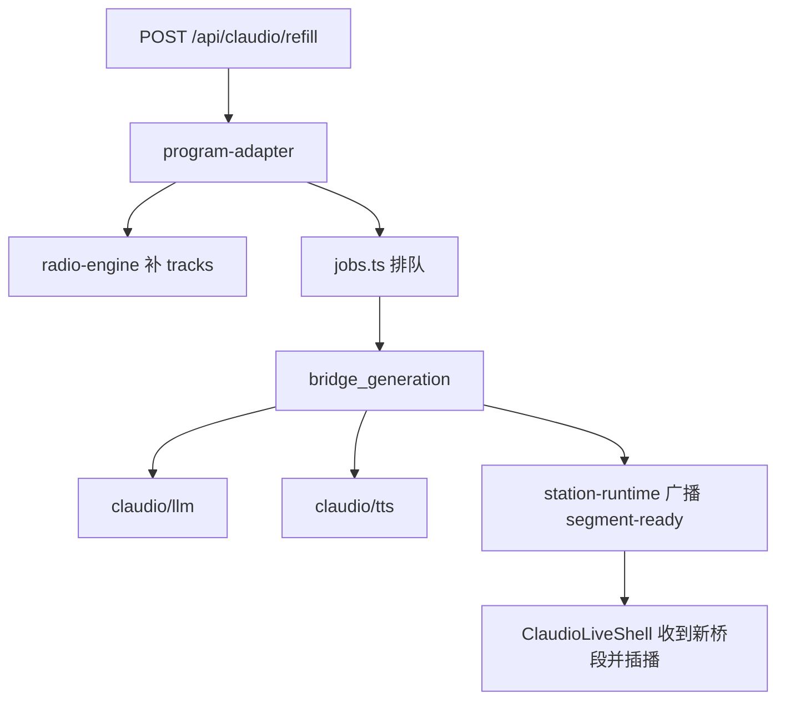

说明：

- `refill` 不只是补歌，还会继续安排 `bridge_generation`。
- `segment-ready` 到达前，队列也可以先继续走；到达后再在合适的位置播报。

## 模块分层

### 前端层

- `src/components/player-shell.tsx`
  主页面 UI、聊天 UI、顶部字体和登录按钮都在这里。
- `src/components/claudio-live-shell.tsx`
  Claudio live 页，消费 `/api/claudio/stream`，负责 TTS/音频播放推进。
- `src/app/claudio-live/page.tsx`
  Claudio live 页面入口。

### API 层

- `src/app/api/agent/route.ts`
  主聊天流式接口。
- `src/app/api/netease-login/route.ts`
  网易云二维码登录接口。
- `src/app/api/preference-insights/route.ts`
  偏好模型只读观测接口，给首页学习面板使用。
- `src/app/api/claudio/start/route.ts`
  启动 Claudio 节目。
- `src/app/api/claudio/refill/route.ts`
  Claudio 补歌。
- `src/app/api/claudio/control/route.ts`
  `next / pause / resume / volume` 控制。
- `src/app/api/claudio/stream/route.ts`
  Claudio SSE 事件流。
- `src/app/api/claudio/tts/[filename]/route.ts`
  Claudio TTS 文件播放出口。
- `src/app/api/audio/route.ts`
  本地音乐文件代理与 Range 支持。

### Claudio runtime 层

- `src/lib/claudio/types.ts`
  `track / segment / event / station state / job` 协议定义。
- `src/lib/claudio/station-runtime.ts`
  单例状态容器、订阅广播、当前节目状态。
- `src/lib/claudio/jobs.ts`
  串行 job worker，负责 bridge 等异步任务。
- `src/lib/claudio/program-adapter.ts`
  把现有 `radio-engine` 产物转换为 Claudio 所需的 `tracks + segments + events`。
- `src/lib/claudio/live-music.ts`
  Claudio live 在线搜歌入口，负责搜索 seed、可播校验、学习偏好反哺和探索模式。
- `src/lib/claudio/segment-normalizer.ts`
  统一 bridge/cold open/intro segment 的结构。
- `src/lib/play-request-executor.ts`
  显式点播执行器（2026-06-02 增量）。纯增量模块：play-artist 走"只搜不切"返回 top 3 候选，play-song-by-artist 走"搜 → 评分 → 拿可播 URL → 替换 currentTrack"。不 import `radio-engine` / `online-radio` / `preference-learning`，不写 preference_event，不动 daily-schedule。
- **统一播放器动作层（2026-06-02 增量，Phase 7）**：在 `src/components/player-shell.tsx` 内部新增 `playerActionsRef = useRef<PlayerActions>`，暴露 6 个独立函数（`pause / resume / replay / volumeUp / volumeDown / setVolumeTo`）。`togglePlayback` 内部已重构成调 `resumeAudio / pauseAudio`，按钮 onClick 和聊天 SSE control 帧走完全同一份实现。后续扩"上一首/下一首/收藏/下载"进聊天控制时，扩 `PlayerActions` 类型 + 那个按钮的 onClick 改 `playerActionsRef.current.xxx()` 即可。
- **Similar / Avoid-Current 旁路（2026-06-03 增量，Phase 11-12）**：chat-agent 头部新增 `resolveSimilarIntent` + `resolveAvoidIntent` 两个纯函数识别器。`similar` action 写 `similar_request` preference event（+1.2 分）+ 构造 `messageHint = "类似 X 的 Y，风格延续，标签：t1,t2,t3"` → `applyOnlineChatIntent({action:"similar", messageHint})` → `regenerateOnlineRadioProgram({action:"regenerate", messageHint, excludeTrackIds:[currentTrack.id]})`。`avoid-current` 写 `avoid_signal` preference event（-1.5 分）+ `reason` 字段 → `applyOnlineChatIntent({action:"avoid-current", messageHint:reason})` → `regenerateOnlineRadioProgram({action:"fresh", messageHint, excludeTrackIds:[currentTrack.id, ...queue]})`。两个 action 都不进 9 个 action 列表、不写 feedbackBias、不污染原 9 个 action 链路。反馈闭环靠 `playback_completed/interrupted` + `avoid_signal` 现有事件流覆盖，**不**写新计分逻辑。

### 模型与 TTS 层

- `src/lib/providers/chat-llm.ts`
  主聊天与推荐语重写共用的 provider 封装。
- `src/lib/claudio/llm.ts`
  Claudio 专用节目文案生成。
- `src/lib/claudio/tts.ts`
  Claudio 专用 TTS 合成与缓存。

支持配置：

- `LLM_PROVIDER=minimax|deepseek`
- `TTS_PROVIDER=minimax|volcengine`

### 数据层

- `src/lib/online-radio.ts`
  首页默认在线推荐链路。它和 Claudio live 共用同一批在线搜索/可播校验能力，但输出目标不同：
  首页输出 `RadioProgram`，Claudio live 输出 `ClaudioTrack[]`。
  这层的职责是选歌、过滤、去重、排序、学习反哺，不是成为最终在线播放地址的权威来源。
- `src/app/api/song-playback/route.ts`
  在线歌曲播放解析入口。搜索试听和首页当前歌都应统一走这里，把 `MusicSearchHit` 解析成真实可播地址。
- `src/lib/preference-learning.ts`
  推荐学习层：行为事件落盘、偏好模型聚合、学习面板观测、后续推荐反哺首页和 Claudio live。
- `src/lib/radio-engine.ts`
  旧本地选歌入口；当前更多是 `local` 模式回退和 Claudio 兼容层。
- `data/`
  本地持久化数据，如 `songs / memory / schedule / online-radio-state / preference-events / preference-model`。
- `src/lib/netease-session.ts`
  网易云登录 cookie 生命周期管理。

## 当前边界

已经完成：

- 主聊天 UI 与 Claudio live UI 并存。
- 主聊天出口已迁到 `minimax/deepseek`。
- Claudio `start -> 开场 TTS -> 首歌 -> refill -> bridge -> 下一首` 主流程已跑通。
- 网易云二维码登录已接回项目。
- 首页在线推荐已经接上增强版自学习闭环：推荐生成、聊天控歌、收藏、下载、重播、播放完成/中断都会进入事件流，并聚合成带时间衰减、scene 分层和负反馈的偏好模型。
- 首页聊天已经不再只是显式命令入口，也开始承担“自由音乐请求 -> 重组推荐 LIST”的主入口职责。
- 首页推荐队列已经支持“熟悉延续 + 新发现”混合编排，既保留符合口味的连续性，也保留受控探索。
- 首页已有学习面板，能直接观察 top artists / languages / tags、scene profile、avoid signals 和 recent events。
- 首页在线播放链路已经明确往"推荐给内容，播放时统一解链"的方向收口，不再让推荐层和播放层各自持有一套最终 URL。
- Claudio live 的在线搜歌已经接入同一套学习上下文：会参考 confidence、scene 偏好和 exploration mode 生成 seed/query/ranking。
- Claudio live 的真实播放完成/中断事件已回流到 `preference-events`，开始和首页共用同一条学习数据带。
- 2026-06-03 mood 关键词扩到 28 组（Phase 10）：覆盖炸/嗨翻/带感/上头/困/跑步/派对/怀旧/浪漫/听腻/避开等用户口语高频词，全部走 `regenerate + messageHint` 智能优先路径。
- 2026-06-03 新增 `similar` action（Phase 11）：用户说"再来点这种/类似的/和这首一样"→ chat-agent 把 currentTrack 特征拼成 messageHint → online-radio 走智能优先搜索。**反馈闭环**靠 playback_completed/interrupted/avoid_signal 现有事件流，**不**写新计分逻辑。
- 2026-06-03 新增 `avoid-current` action（Phase 12）：用户说"太吵了/太老了/不喜欢这首"→ 写一条 `avoid_signal` preference event（-1.5 分）+ reason 字段，online 模式走 fresh + excludeCurrent + excludeQueue；local 模式 fallback 到 skip。
- 2026-06-03 LLM 路由器 time 注入（Phase 13）：prompt 加 `实际时间: 周X HH:MM（${timeOfDay}${isWeekend ? "，周末" : ""}）`，新增"时间敏感"+"周末感知"两条路由器规则，让 messageHint 反映早高峰/午休/晚间/深夜差分。

还未完成：

- `Claudio live` 的 caller/chat on-air 流程还没接。
- 首页与 live 还没有完全统一成同一个节目编排后端，目前只是共享学习核心和部分在线搜歌能力。
- Claudio live 侧还没有收藏/跳过/显式反馈按钮，因此 live 的偏好回流还主要依赖自然播放完成/中断。
- 自学习层虽已具备时间衰减、探索策略、scene 分层和轻量面板，但还没有独立调试页，也没有更强的策略评估。
- 外部对照页 `src/app/claudio-live/external/route.ts` 仍保留，仅用于对照。
- 显式点播旁路在 frontend UI 形态上只走"数字 1/2/3 / 歌名 / 第 N 首 / 就这首"等纯文本回复，**已升级**为可点击候选卡（Phase 15，2026-06-03）：assistant 气泡内挂 `message.meta?.pendingCandidates` 渲染**旧 .queueCard 卡片**（fit-content 宽度 / 圆形序号 / title+artist 两行，跟原 chatLog 卡片组视觉一致），点击 `setChatInput(cand.title) + sendChatMessage()` 触发后端 `matchPendingCandidate` 现有链路。后端链路 0 改动。
- 聊天触发播放器控件目前只接了"暂停/继续/重播/音量"。**后续要扩"上一首/下一首/收藏/下载/歌词"等进聊天**只需扩 `PlayerActions` 类型 + 那个按钮的 onClick 改 `playerActionsRef.current.xxx()`，零架构改动。chat-agent 旁路 + SSE control 帧协议已就绪。
- 候选列表"换一批"重搜（Phase 8）已接进 play-request 旁路——用户说"换/换一批/还有吗"等关键词 + 上一条是 candidateList 时重搜同一歌手 top 3（去重已展示候选）。**无候选上下文时 fall through 到原 9 个 action 链路**，"换一批" regenerate 走 radio-engine 保持原行为。assistant 文本用"X 的其他歌，刷新一下："区别于首轮"X 的歌"。
- LLM 路由器 + mood keyword 兜底（Phase 9）已接进 chat-agent——LLM 路由器对"今天有点累/想家了/嗨一点/夜深了"等 mood 表达判 none 时，keyword 兜底补回 `regenerate + messageHint`，走原 `applyOnlineChatIntent` 链路（messageHint 智能优先路径）。18 组关键词覆盖 5 类信号（情绪/风格/时刻/否定），不命中 fall through 到 LLM 闲聊。`resolver: "mood-keyword"` 写进 preference-learning 事件可观测。**未做**：keyword 库手工维护（后续可接 LLM 自动扩词）、多 keyword 冲突时只取 weight 最高（不做复杂合并）、不命中时给用户主动追问"想听点什么？"（保持当前 fall through 到 LLM DJ 闲聊）。

## 后续唯一主线

推荐相关工作的后续方向已经收敛，不再以“多加几个功能按钮”为主，而是只围绕下面这件事推进：

- 把 Claudio 做成一个越来越懂你的音乐 Agent，并且能通过真实使用行为持续自我学习

拆成工程目标就是：

1. 提高事件采样质量，让所有真实偏好信号都能进入数据层
2. 提高偏好模型表达能力，让系统分得清长期口味、短期状态、scene 差异和负反馈
3. 提高模型对 seed/query/ranking 的反哺强度，让“学到的偏好”真实改变推荐结果
4. 把自由聊天稳定变成推荐控制入口，让用户随口一句话就能切换风格而不是学习命令
5. 把在线播放链稳定成单一职责：推荐只产出歌曲内容，播放统一走同一个解析入口
6. 把这套能力迁回 Claudio live，并最终统一节目编排核心

也就是说，后续如果有新功能进入推荐链路，默认要回答一个问题：
它能不能让系统更准确地学会你，并把这种理解反映到下一轮歌单里，而不是只是多一个静态规则。
同时还要回答第二个问题：
它有没有破坏“推荐负责内容、播放负责解链”的边界。

## 配置关系

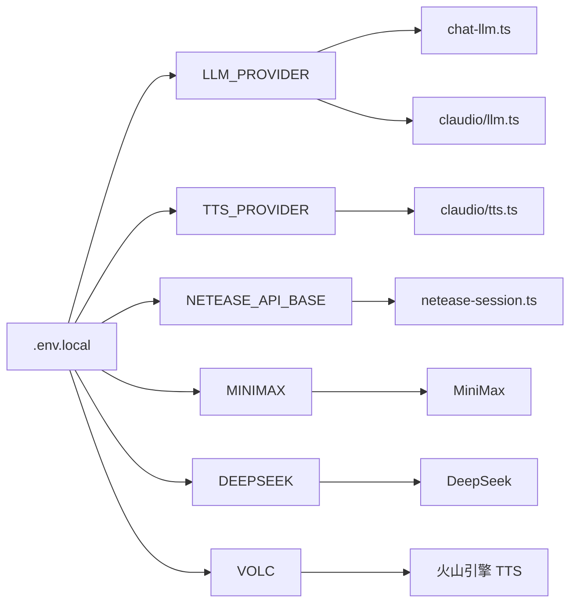

## 部署视角

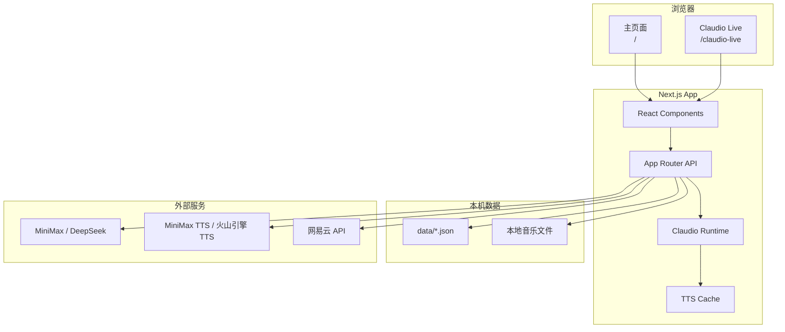

这张图看的是“程序部署在哪、依赖谁”：

- 浏览器里只有两个主要入口：主页面和 `Claudio Live`。
- 核心逻辑都在同一个 `Next.js App` 里，没有额外常驻独立 Claudio 服务。
- 本地数据仍分成两类：`data/*.json` 状态数据，和本地音乐文件。
- 模型、TTS、网易云都还是外部依赖。

## 开台详细时序

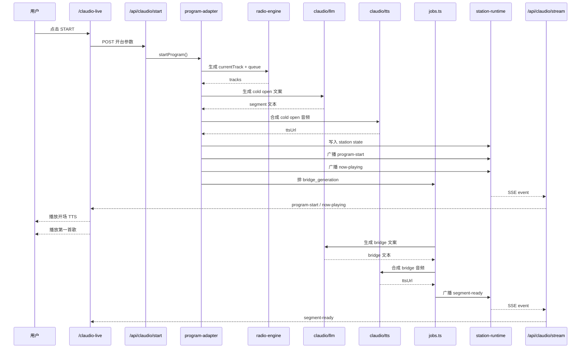

这张图看的是“点下 START 后，主流程怎么一步步跑完”：

- `online` 模式下由 `claudio/live-music.ts` 负责拿可播歌曲，并接入偏好学习和探索模式；`local` 回退模式仍走 `radio-engine`。
- `claudio/llm.ts` 负责把节目口播内容生成出来。
- `claudio/tts.ts` 把口播变成实际可播音频。
- `station-runtime` 统一对外广播状态。
- `jobs.ts` 把 bridge 这种异步后续任务串起来，不阻塞首歌启动。

建议配合阅读：

- [src/components/player-shell.tsx](/Users/lipan/Desktop/radio-app/src/components/player-shell.tsx)
- [src/components/claudio-live-shell.tsx](/Users/lipan/Desktop/radio-app/src/components/claudio-live-shell.tsx)
- [src/lib/claudio/program-adapter.ts](/Users/lipan/Desktop/radio-app/src/lib/claudio/program-adapter.ts)
- [src/lib/claudio/station-runtime.ts](/Users/lipan/Desktop/radio-app/src/lib/claudio/station-runtime.ts)
